# 🌊 Finity - Infinite Learning & Entertainment

<div align="center">
  
  
  [](https://flutter.dev/)
  [](https://dart.dev/)
  [](LICENSE)
  [](https://flutter.dev/)
  
  **Discover, Learn, and Share Knowledge in an Infinite Loop**
</div>

---

## 🚀 What is Finity?

Finity is a revolutionary educational app that transforms Wikipedia content into engaging, TikTok-style experiences. It combines the depth of Wikipedia with the addictive scroll format of modern social media, making learning fun and accessible for everyone.

### 🎯 Core Concept

- **Infinite Learning**: Endless scroll of educational content
- **Dual Experience**: Switch between detailed Flow and quick Loops
- **Multilingual**: Support for 13+ languages
- **Personalized**: Like, save, and share your favorite content
- **Offline-Ready**: Works without internet connection

---

## ✨ Key Features

### 🌊 Finity Flow
- **Long-form Content**: Detailed Wikipedia articles
- **Rich Media**: Images, summaries, and full articles
- **Deep Dive**: Comprehensive learning experience
- **Background Music**: Ambient music for focused reading
- **Smart Caching**: Instant loading with offline support

### 🔄 Finity Loops
- **Short-form Content**: Bite-sized learning chunks
- **Visual Stories**: Image-rich content cards
- **Quick Learning**: Perfect for micro-learning sessions
- **Vertical Scroll**: TikTok-style interface
- **Auto-Play Music**: Curated background music

### 💝 Finity Hearts (Liked Content)
- **Personal Library**: Save your favorite content
- **Dual Organization**: Separate Flow and Loops collections
- **Offline Access**: View liked content anytime
- **Easy Sharing**: Share your discoveries
- **Smart Filtering**: Quick access to specific content types

### 🎵 Smart Music System
- **Adaptive Playback**: Different music for different content
- **Apple Music Integration**: High-quality preview tracks
- **Content-Aware**: Music matches the content mood
- **Seamless Experience**: Smooth transitions between tracks
- **Mute Control**: Easy toggle for silent reading

### 🌍 Multilingual Support
Support for 13 languages with real-time content translation:
- 🇺🇸 English
- 🇪🇸 Español (Spanish)
- 🇫🇷 Français (French)
- 🇩🇪 Deutsch (German)
- 🇮🇹 Italiano (Italian)
- 🇵🇹 Português (Portuguese)
- 🇷🇺 Русский (Russian)
- 🇨🇳 中文 (Chinese)
- 🇯🇵 日本語 (Japanese)
- 🇰🇷 한국어 (Korean)
- 🇸🇦 العربية (Arabic)
- 🇮🇳 हिन्दी (Hindi)
- 🇮🇳 தமிழ் (Tamil)

---

## 🎨 Screenshots

<div align="center">
  <table>
    <tr>
      <td align="center">
        
        <br><b>Splash Screen</b>
      </td>
      <td align="center">
        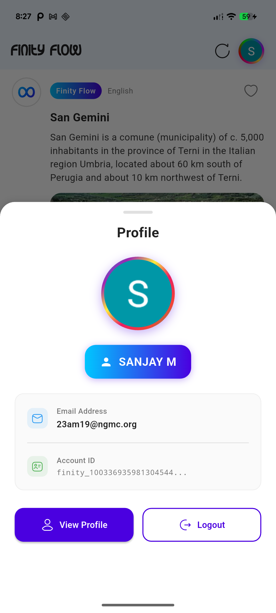
        <br><b>OProfile</b>
      </td>
      <td align="center">
        
        <br><b>Google Sign-In</b>
      </td>
    </tr>
    <tr>
      <td align="center">
        
        <br><b>Finity Flow - Home</b>
      </td>
      <td align="center">
        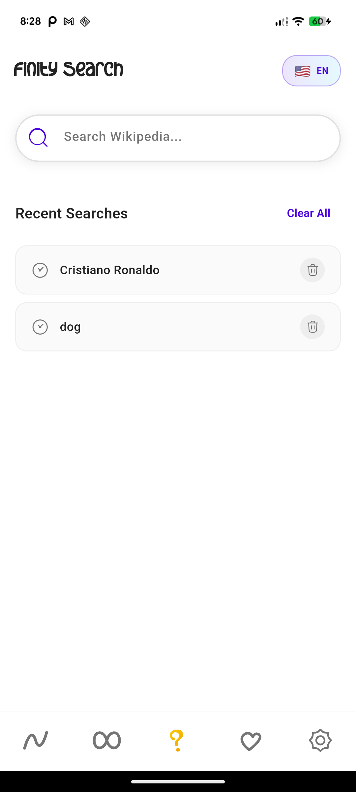
        <br><b>Flow Content Detail</b>
      </td>
      <td align="center">
        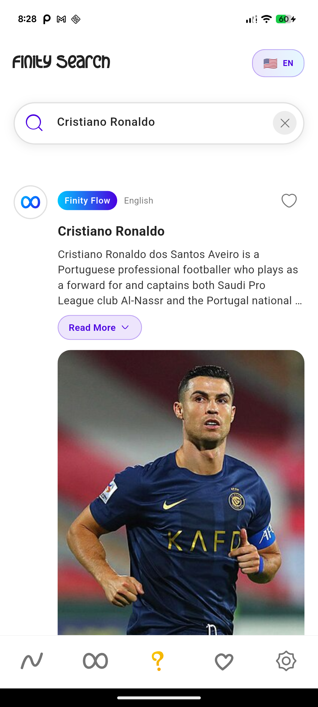
        <br><b>Finity Player</b>
      </td>
    </tr>
    <tr>
      <td align="center">
        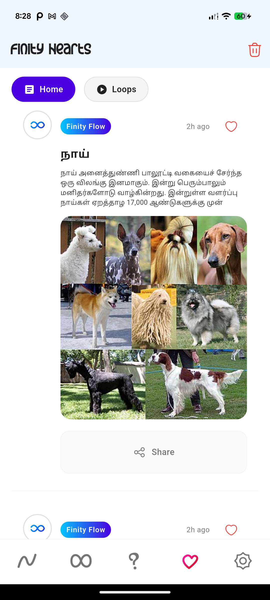
        <br><b>Finity Loops</b>
      </td>
      <td align="center">
        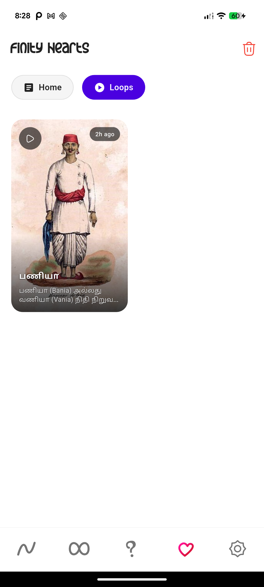
        <br><b>Loops Content Detail</b>
      </td>
      <td align="center">
        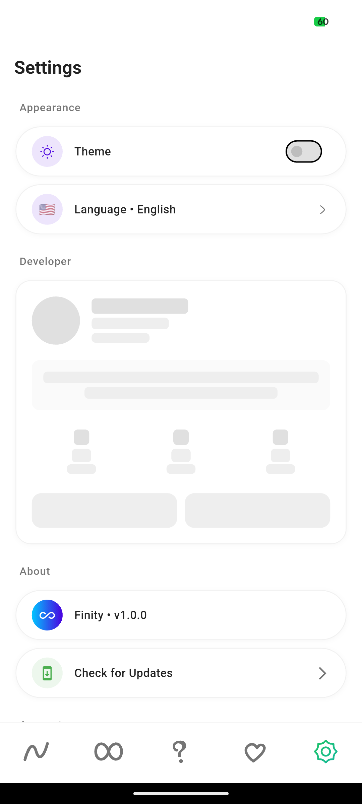
        <br><b>Loops with Music</b>
      </td>
    </tr>
    <tr>
      <td align="center">
        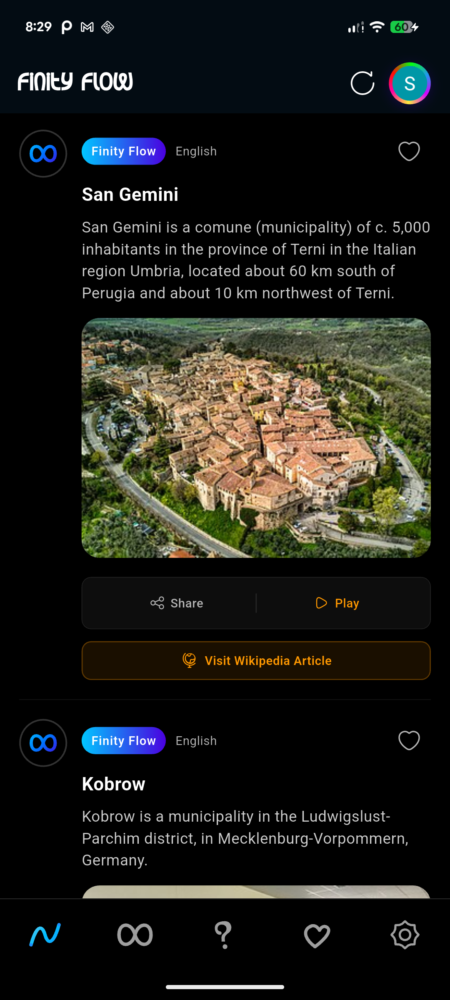
        <br><b>Search Functionality</b>
      </td>
      <td align="center">
        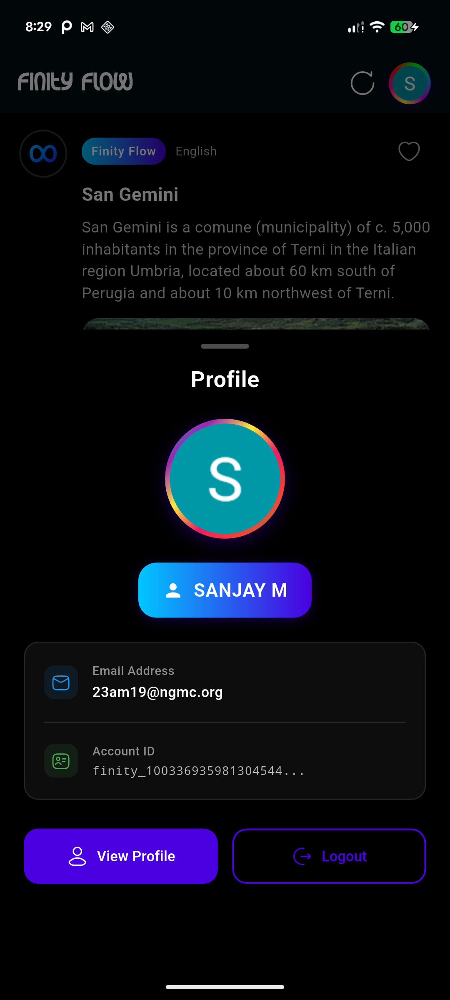
        <br><b>Search Results</b>
      </td>
      <td align="center">
        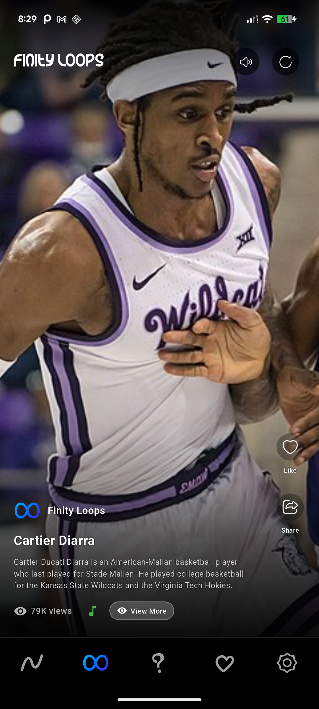
        <br><b>Finity Hearts - Liked</b>
      </td>
    </tr>
    <tr>
      <td align="center">
        
        <br><b>Liked Flow Content</b>
      </td>
      <td align="center">
        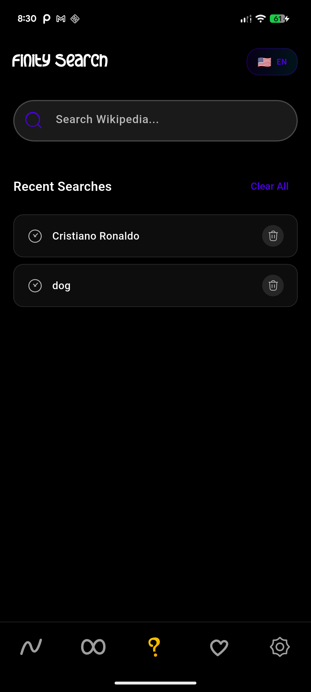
        <br><b>Liked Loops Content</b>
      </td>
      <td align="center">
        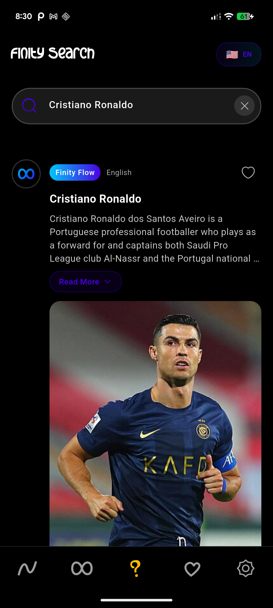
        <br><b>Settings & Profile</b>
      </td>
    </tr>
    <tr>
      <td align="center">
        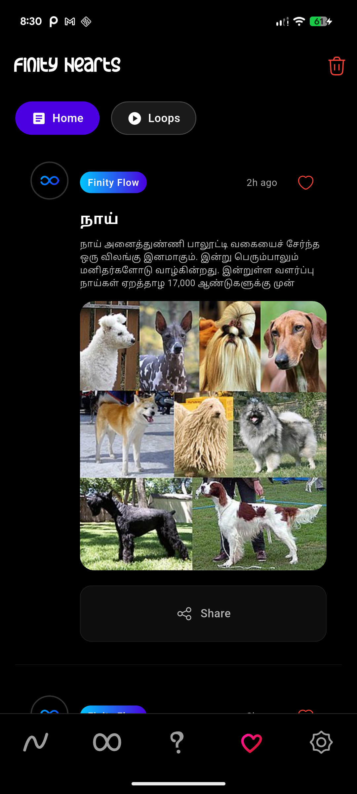
        <br><b>Language Selection</b>
      </td>
      <td align="center">
        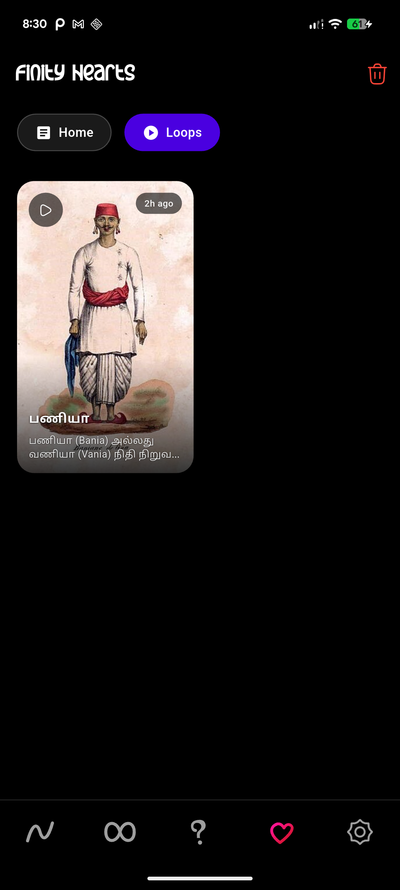
        <br><b>Dark Mode Theme</b>
      </td>
      <td align="center">
        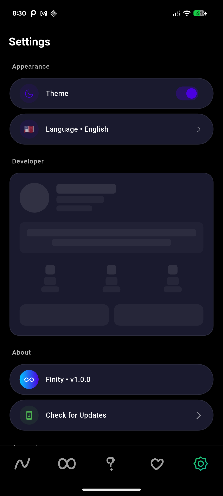
        <br><b>Update Checker</b>
      </td>
    </tr>
    
  </table>
</div>

---

## 🛠️ Technologies & Architecture

### 🎯 Frontend Framework
- **Flutter 3.2.0+**: Cross-platform mobile development
- **Dart 3.0+**: Programming language
- **Material Design 3**: Modern UI/UX guidelines
- **Responsive Design**: Adaptive layouts for all screen sizes

### 🎨 UI/UX Libraries
- **flutter_screenutil**: Responsive screen adaptation
- **auto_size_text**: Adaptive text sizing
- **animations**: Smooth page transitions
- **flutter_staggered_grid_view**: Masonry grid layouts
- **hugeicons**: Comprehensive icon library

### 🔧 Core Technologies
- **Provider**: State management solution
- **SharedPreferences**: Local data persistence
- **SQLite (sqflite)**: Local database for offline content
- **HTTP**: RESTful API communication
- **Path Provider**: File system access

### 🎵 Media & Audio
- **AudioPlayers**: Background music playback
- **Apple Music API**: Music streaming integration
- **Cached Network Image**: Optimized image loading
- **Image Shimmer**: Loading placeholders

### 🔐 Authentication & Security
- **Firebase Auth**: Secure user authentication
- **Google Sign-In**: OAuth2 integration
- **Fallback Auth**: Custom authentication system
- **Secure Storage**: Encrypted user data

### 🌐 External APIs
- **Wikipedia API**: Content source
- **Apple Music API**: Background music
- **iTunes Search API**: Music discovery
- **Google APIs**: Authentication services

### 📱 Platform Integration
- **URL Launcher**: External link handling
- **Share Plus**: Native sharing functionality
- **Package Info Plus**: App version management
- **Permission Handler**: Runtime permissions

---

## 🏗️ App Architecture

```
📱 Finity App
├── 🎨 Presentation Layer
│   ├── Screens (UI Components)
│   ├── Widgets (Reusable Components)
│   └── Themes (Dark/Light Mode)
├── 🧠 Business Logic Layer
│   ├── Providers (State Management)
│   ├── Services (Business Logic)
│   └── Models (Data Structures)
├── 💾 Data Layer
│   ├── Local Database (SQLite)
│   ├── Shared Preferences
│   └── Network APIs
└── 🔧 Platform Layer
    ├── Native Features
    ├── File System
    └── Hardware Access
```

---

## 🎮 Use Cases & Benefits

### 👨‍🎓 For Students
- **Quick Learning**: Bite-sized educational content
- **Research Tool**: Access to vast Wikipedia knowledge
- **Language Learning**: Multilingual content support
- **Offline Study**: Download content for offline access
- **Visual Learning**: Image-rich content presentation

### 🧑‍🏫 For Educators
- **Teaching Aid**: Engaging content for classrooms
- **Curriculum Support**: Wide range of educational topics
- **Interactive Learning**: Modern interface for digital natives
- **Content Sharing**: Easy sharing of educational materials
- **Progress Tracking**: Monitor learning engagement

### 📚 For Knowledge Enthusiasts
- **Continuous Learning**: Infinite scroll of knowledge
- **Diverse Topics**: Explore various subjects
- **Personal Library**: Save interesting discoveries
- **Social Sharing**: Share knowledge with friends
- **Customizable Experience**: Personalized content feed

### 🌍 For Global Users
- **Language Accessibility**: 13+ language support
- **Cultural Content**: Localized Wikipedia articles
- **Inclusive Design**: RTL language support
- **Global Knowledge**: Access to worldwide information
- **Cross-Cultural Learning**: Diverse perspectives

---

## 🚀 Getting Started

### Prerequisites
- Flutter SDK 3.2.0 or higher
- Dart SDK 3.0 or higher
- Android Studio / VS Code
- Android SDK (for Android development)
- Xcode (for iOS development)

### Installation

1. **Clone the repository**
   ```bash
   git clone https://github.com/sanjay434343/Finity.git
   cd Finity
   ```

2. **Install dependencies**
   ```bash
   flutter pub get
   ```

3. **Configure Firebase** (Optional)
   ```bash
   # Add your google-services.json for Android
   # Add your GoogleService-Info.plist for iOS
   ```

4. **Run the app**
   ```bash
   flutter run
   ```

### Build for Production

```bash
# Android APK
flutter build apk --release

# Android App Bundle
flutter build appbundle --release

# iOS
flutter build ios --release
```

---

## 📦 Project Structure

```
lib/
├── main.dart                 # App entry point
├── models/                   # Data models
│   └── app_model.dart
├── providers/                # State management
│   └── theme_provider.dart
├── screens/                  # UI screens
│   ├── splash_screen.dart
│   ├── onboarding_screen.dart
│   ├── login_screen.dart
│   ├── main_screen.dart
│   ├── home_screen.dart
│   ├── loops_screen.dart
│   ├── liked_screen.dart
│   ├── settings_screen.dart
│   ├── search_screen.dart
│   └── player_screen.dart
├── services/                 # Business logic
│   ├── auth_service.dart
│   ├── content_service.dart
│   ├── music_service.dart
│   ├── language_service.dart
│   ├── share_service.dart
│   ├── local_database.dart
│   └── search_service.dart
├── widgets/                  # Reusable components
│   ├── custom_bottom_nav.dart
│   └── image_shimmer.dart
└── utils/                    # Utility functions
    └── constants.dart
```

---

## 🎨 Design Philosophy

### Modern & Intuitive
- **Clean Interface**: Minimalist design focused on content
- **Smooth Animations**: Fluid transitions and interactions
- **Consistent Branding**: Unified visual language throughout
- **Accessible Design**: WCAG 2.1 compliance for inclusivity

### Performance First
- **Optimized Loading**: Smart caching and preloading
- **Memory Efficient**: Intelligent resource management
- **Battery Friendly**: Optimized for mobile devices
- **Network Aware**: Adaptive content loading

### User-Centric
- **Personalization**: Tailored content recommendations
- **Offline Support**: Works without internet connection
- **Cross-Platform**: Consistent experience across devices
- **Accessibility**: Screen reader and keyboard navigation support

---

## 🔧 Configuration

### Environment Variables
Create a `.env` file in the root directory:
```env
WIKIPEDIA_API_BASE_URL=https://en.wikipedia.org/api/rest_v1
APPLE_MUSIC_API_URL=https://itunes.apple.com/search
FIREBASE_PROJECT_ID=your-project-id
```

### Firebase Setup
1. Create a Firebase project
2. Enable Authentication and Firestore
3. Download configuration files
4. Place them in appropriate directories

### API Keys
- **Apple Music**: iTunes Search API (No key required)
- **Wikipedia**: Wikipedia REST API (No key required)
- **Firebase**: Configured via JSON files

---

## 🎯 Roadmap

### Version 2.0 (Upcoming)
- [ ] **AI-Powered Recommendations**: Machine learning content suggestions
- [ ] **Voice Search**: Voice-activated content discovery
- [ ] **Augmented Reality**: AR visualization for complex topics
- [ ] **Collaborative Learning**: Social features and study groups
- [ ] **Advanced Analytics**: Learning progress tracking

### Version 2.1
- [ ] **Video Content**: Integration with educational videos
- [ ] **Quiz System**: Interactive knowledge testing
- [ ] **Bookmark Sync**: Cloud synchronization of saved content
- [ ] **Dark Theme Plus**: Enhanced dark mode options
- [ ] **Accessibility Plus**: Advanced accessibility features

### Future Enhancements
- [ ] **Offline AI**: On-device content generation
- [ ] **Smart Summaries**: AI-generated content summaries
- [ ] **Learning Paths**: Structured educational journeys
- [ ] **Community Features**: User-generated content and discussions
- [ ] **Gamification**: Achievement system and learning streaks

---

## 🤝 Contributing

We welcome contributions! Please see our [Contributing Guide](CONTRIBUTING.md) for details.

### Development Setup
1. Fork the repository
2. Create a feature branch
3. Make your changes
4. Add tests if applicable
5. Submit a pull request

### Code Style
- Follow Dart/Flutter style guidelines
- Use meaningful variable names
- Add comments for complex logic
- Maintain consistent formatting

---

## 📄 License

This project is licensed under the MIT License - see the [LICENSE](LICENSE) file for details.

---

## 👨‍💻 Developer

<div align="center">
  
  
  **Sanjay**
  
  [](https://github.com/sanjay434343)
  [](mailto:sanjay13649@gmail.com)
  
  *Passionate Flutter developer creating innovative educational experiences*
</div>

---

## 🙏 Acknowledgments

- **Wikipedia**: For providing free access to human knowledge
- **Apple Music**: For high-quality music streaming
- **Flutter Community**: For amazing packages and support
- **Material Design**: For design guidelines and principles
- **Open Source Community**: For inspiration and contributions

---

## 📊 App Statistics

- **Languages Supported**: 13+
- **Wikipedia Articles**: 6M+ accessible
- **Music Tracks**: 30M+ available
- **Offline Storage**: Smart caching system
- **Performance**: 60 FPS smooth animations
- **Size**: ~50MB optimized APK

---

## 📞 Support

Having issues? We're here to help!

- 🐛 **Bug Reports**: [Create an issue](https://github.com/sanjay434343/Finity/issues)
- 💡 **Feature Requests**: [Suggest features](https://github.com/sanjay434343/Finity/discussions)
- 📧 **Email Support**: sanjay13649@gmail.com
- 📖 **Documentation**: Check our [Wiki](https://github.com/sanjay434343/Finity/wiki)

---

<div align="center">
  <h3>🌟 Star this repo if you like Finity! 🌟</h3>
  
  **Made with ❤️ and Flutter**
  
  ---
  
  *"Learning is not attained by chance, it must be sought for with ardor and diligence."* - Abigail Adams
</div>
